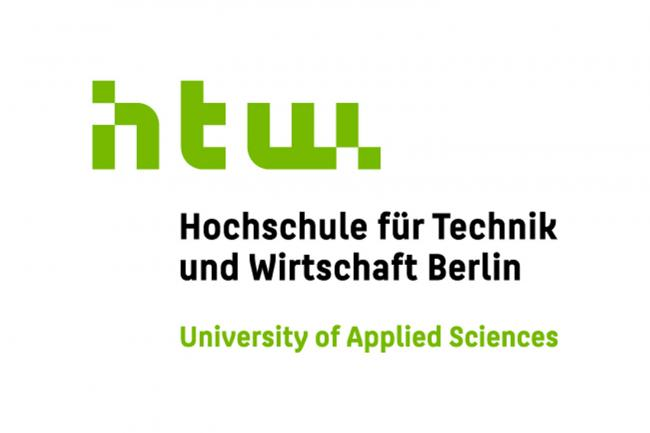
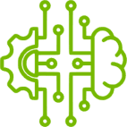

## Willkommen in der Werkstatt!

Mit der KI-Werkstatt schafft die HTW Berlin einen Ort für das gemeinsame Lehren, Forschen und Anwenden von KI-Technologie auf aktuelle Praxisprobleme. Hier finden Sie ausgewählte Lehrmaterialien, Templates und Demonstratoren. 

 Mehr über unser Team und unsere Projekte finden Sie auf der [Projektwebseite](https://kiwerkstatt.f2.htw-berlin.de/).  

 
 Hier geht es zu den aktuellen Vorlesungen:
 
<table "border-collapse: collapse;">
  <tr style="border: none;">
    <td style="border: none;"></td>
    <td style="border: none;"> </td>
    <td style="border: none;"></td>
  </tr>
  <tr style="border: none;">
    <td style="border: none;"><a href="https://htw-berlin-ki-werkstatt.github.io/ml-lecture/">Machine Learning</a></td>
    <td style="border: none;"><a href="https://chkra.github.io/ds-lecture/">Data Science</a></td>
    <td style="border: none;"><a href="https://chkra.github.io/KISys/">Wissens- und KI- basierte Systeme</a></td>
  </tr>
</table>
 
 
